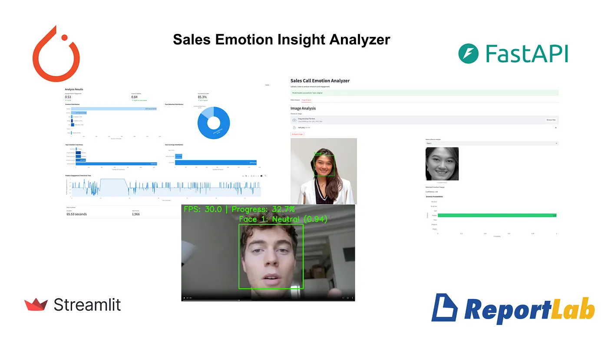
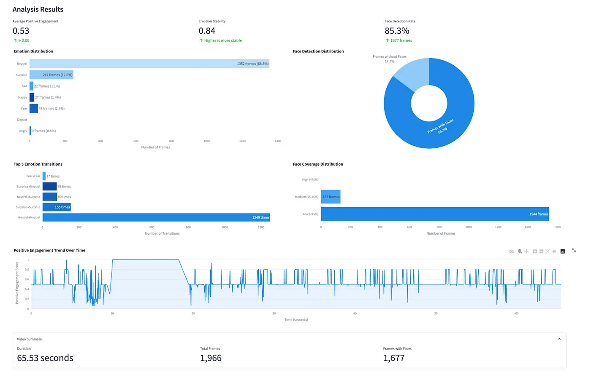
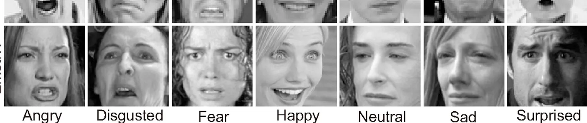
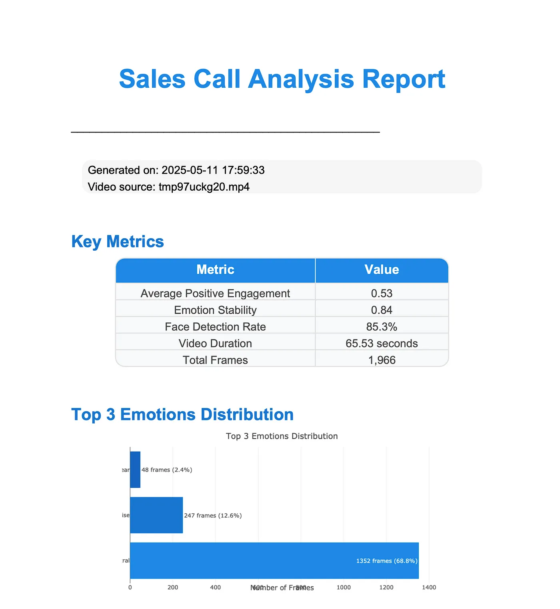
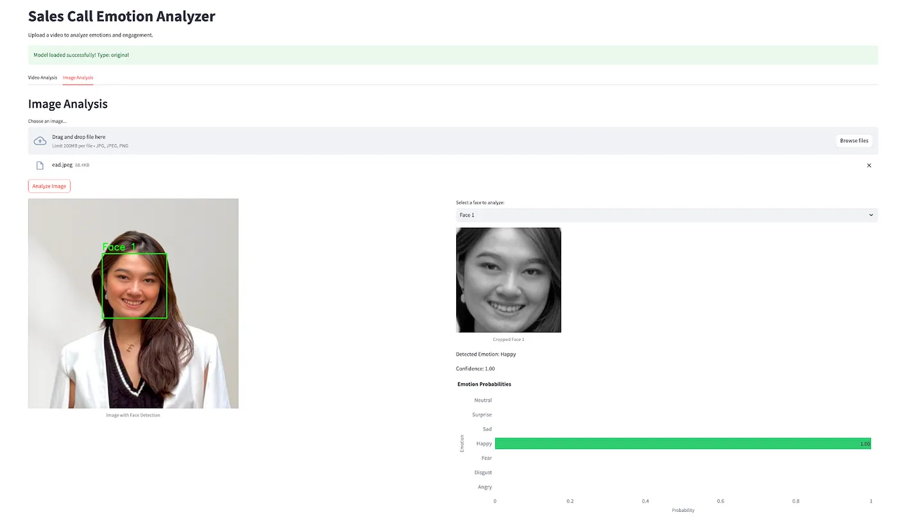

# Sales Call Emotion Analyzer



A deep learning-based application for analyzing emotions and engagement in sales call videos from Zoom recordings. The system uses computer vision and deep learning to detect facial expressions and provide real-time analysis of emotional patterns during sales calls.


## Quick Start

1. **Install Prerequisites**:

   ```bash
   # Install system dependencies
   brew install python3
   pip3 install virtualenv
   ```
2. **Setup Environment**:

   ```bash
   # Create and activate virtual environment
   python3 -m venv venv
   source venv/bin/activate  # On Windows: venv\Scripts\activate

   # Install Python dependencies
   pip install -r requirements.txt
   ```
3. **Run the Application**:

   ```bash
   # First, start the FastAPI backend server
   python main.py

   # Then, in a new terminal window, start the Streamlit frontend
   streamlit run app/streamlit_app.py
   ```

   Note: Make sure to keep both the backend and frontend running simultaneously. The backend server must be running for the frontend to work properly.

## Features

- Emotion detection in Zoom video recordings
- Engagement scoring based on emotional patterns
- Face tracking and detection
- Support for multiple model architectures
- Web-based interface using Streamlit
- PDF report generation

## Screenshots


### Source - FER 2013 Emotion Data




### Statistics and Reports



### Image Processing



## Project Structure

```
engagementdetector/
├── app/
│   └── streamlit_app.py      # Streamlit web interface
├── models/
│   ├── emotion_model.py      # Model architectures
│   ├── detect_emotions.py    # Emotion detection logic
│   └── train.py             # Model training code
├── data/
│   └── fer2013/             # FER2013 dataset
├── artifacts/
│   ├── saved_models/        # Trained model checkpoints
│   └── logs/                # Training logs
├── videos/                  # Processed video outputs
├── config.py               # Configuration settings
└── requirements.txt        # Project dependencies
```

## Detailed Usage Guide

### Video Analysis

1. Start the Streamlit interface:

   ```bash
   streamlit run app/streamlit_app.py
   ```
2. Upload your Zoom recording:

   - Supported formats: MP4
   - Ensure video is clear and well-lit
   - Face should be clearly visible
3. View the results:

   - Processed video with emotion labels
   - Engagement metrics
   - Emotion duration statistics
   - PDF report generation

## Data Preparation

### FER2013 Dataset Setup

1. Download the FER2013 dataset:

   - Visit the [FER2013 dataset page](https://www.kaggle.com/datasets/msambare/fer2013)
   - Download the `fer2013.csv` file
2. Place the CSV file:

   ```
   data/fer2013/
   └── fer2013.csv
   ```
3. CSV File Format:

   ```
   emotion,pixels,Usage
   0,48 48 48 ...,Training
   1,48 48 48 ...,PublicTest
   2,48 48 48 ...,PrivateTest
   ```

   Where:

   - emotion: 0-6 (angry, disgust, fear, happy, sad, surprise, neutral)
   - pixels: space-separated pixel values (48x48 grayscale)
   - Usage: Training, PublicTest, or PrivateTest
4. Data Preprocessing (handled automatically):

   - Images are loaded from pixel values in CSV
   - Resized to 48x48 pixels
   - Normalized to [0,1] range
   - Augmented with:
     - Random horizontal flips
     - Random rotations (±10 degrees)
     - Random brightness adjustments
     - Random contrast adjustments
5. Data Splits (based on Usage column):

   - Training set: Usage = "Training"
   - Validation set: Usage = "PublicTest"
   - Test set: Usage = "PrivateTest"

## Engagement Scoring System

The system calculates engagement based on emotional patterns:

### Emotion Weights

| Emotion  | Weight | Description                  |
| -------- | ------ | ---------------------------- |
| Happy    | 1.0    | Highest positive engagement  |
| Surprise | 0.8    | High positive engagement     |
| Neutral  | 0.5    | Neutral engagement           |
| Sad      | 0.3    | Low positive engagement      |
| Fear     | 0.2    | Very low positive engagement |
| Angry    | 0.1    | Very low positive engagement |
| Disgust  | 0.1    | Very low positive engagement |

### Score Calculation

- Final score ranges from 0 to 1
- Maximum score (1.0): Happy emotion with 100% confidence
- Minimum score (0.0): Disgust/Angry emotion with 0% confidence
- System tracks engagement scores over time to calculate:
  - Average engagement
  - Engagement trend
  - Temporal patterns

## Model Training

To train a new model:

1. Prepare your dataset in the FER2013 format
2. Place it in the `data/fer2013` directory
3. Run the training script:
   ```bash
   python -m models.train
   ```
### Training Results


## Configuration

Create a `.env` file with your settings:

```env
# Device Configuration
DEVICE_TYPE=auto  # Options: auto, mps, cuda, cpu
NUM_WORKERS=4
BATCH_SIZE=64
PIN_MEMORY=true

# Training Configuration
NUM_EPOCHS=50
LEARNING_RATE=0.001
MODEL_TYPE=modern  # Options: modern, regularized, original, transfer
MODEL_TYPE_PROD=original  # Model type for production/inference
MODEL_PATH=artifacts/saved_models/original_best_model_20250511_153151.pth

# Dataset Configuration
DATA_DIR=data/fer2013
CSV_FILE=fer2013.csv

# Model Configuration
CONFIDENCE_THRESHOLD=0.5  # Minimum confidence for predictions
SAVE_BEST_ONLY=true

# Video Analysis Configuration
ANALYSIS_INTERVAL=1.0  # Time between frame analyses in seconds
```

## Repository Management

### Files Not Tracked by Git

The following files and directories are intentionally not tracked by Git:

1. **Data Files**

   - `data/` directory and all contents
   - All CSV, JSON, and dataset files
   - FER2013 dataset files
2. **Model Files**

   - `models/weights/`
   - `models/checkpoints/`
   - `models/saved_models/`
   - `artifacts/saved_models/`
   - All model weight files (*.pth, *.pt, *.ckpt)
3. **Video Files**

   - `videos/` directory
   - All video files (*.mp4)
   - Temporary video files (output_tmp*.mp4, temp_*.mp4)
4. **Environment Files**

   - `.env` file
   - Virtual environment directories (venv/, env/)
   - Python version files (.python-version)
5. **Logs and Artifacts**

   - `artifacts/` directory
   - `logs/` directory
   - All log files (*.log)

### Getting Started with a Fresh Clone

After cloning the repository, you'll need to:

1. Create a `.env` file with your configuration
2. Download the FER2013 dataset to `data/fer2013/`
3. Create necessary directories:
   ```bash
   mkdir -p data/fer2013
   mkdir -p models/weights
   mkdir -p models/checkpoints
   mkdir -p models/saved_models
   mkdir -p artifacts/saved_models
   mkdir -p artifacts/logs
   mkdir -p videos
   ```

## Troubleshooting

### Common Issues

1. **Video Processing Errors**

   - Ensure video is in MP4 format
   - Check video file permissions
   - Verify sufficient disk space
2. **Model Loading Errors**

   - Verify model path in `.env` file
   - Check model file exists in specified location
   - Ensure correct model architecture is selected

## Contributing

1. Fork the repository
2. Create a feature branch
3. Commit your changes
4. Push to the branch
5. Create a Pull Request

## Contributors

- [Livia Ellen](https://github.com/liviaellen) - Project Lead & Developer
- [Vitoria Soria](https://github.com/vitoriasoria) - Developer
- [Rafael Cisneros](https://github.com/rafaelcisneros) - Developer

## License

This project is licensed under the MIT License - see the LICENSE file for details.

## Acknowledgments

- FER2013 dataset
- OpenCV for computer vision tasks
- PyTorch for deep learning
- Streamlit for the web interface

## Related Resources
- [Medium Article: Reading Faces, Closing Deals: AI Emotion Detection for Sales Calls](https://medium.com/@racr1999/reading-faces-closing-deals-ai-emotion-detection-for-sales-calls-6d54d87b2b40)
- [Video Demo: Sales Emotion Insight](https://liviaellen.com/sales-emotion-insight)
